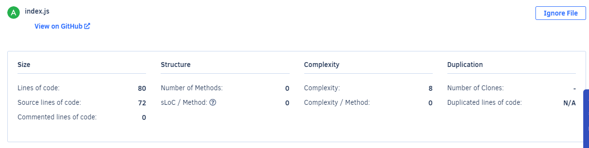
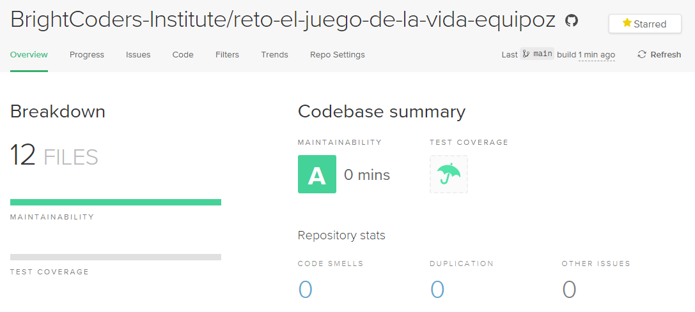

# El Juego de la vida

> [Ver instrucciones antes de iniciar](./instructions.md)

## Table of Contents
- [Description](#description)
- [Installation and Run](#installation-and-run)
- [Usage](#usage)

## Description
The Game of Life is a cellular automaton that simulates the evolution of patterns on a two-dimensional grid. It follows simple rules to determine the state of each cell based on its neighbors.

## Installation and Run
- Clone this repo: `git clone
- Change to the repo directory: `cd game-of-life`
- Install dependencies: `npm install`

## Usage
To customize the game, you can modify the following variables in the `index.js` file:
- `numRows`: Number of rows in the grid.
- `numCols`: Number of columns in the grid.
- `numGenerations`: Number of generations to simulate.

Feel free to experiment with different patterns and configurations to observe the different behaviors that emerge.

## Credits
- [BrightCoders](https://www.brightcoders.dev/)
- [J3fte](santillanabdiel0@gmail.com)
- [Eduardoespl](eduardoesp3317@gmail.com)

## Badges
# Qualification with Codacy

